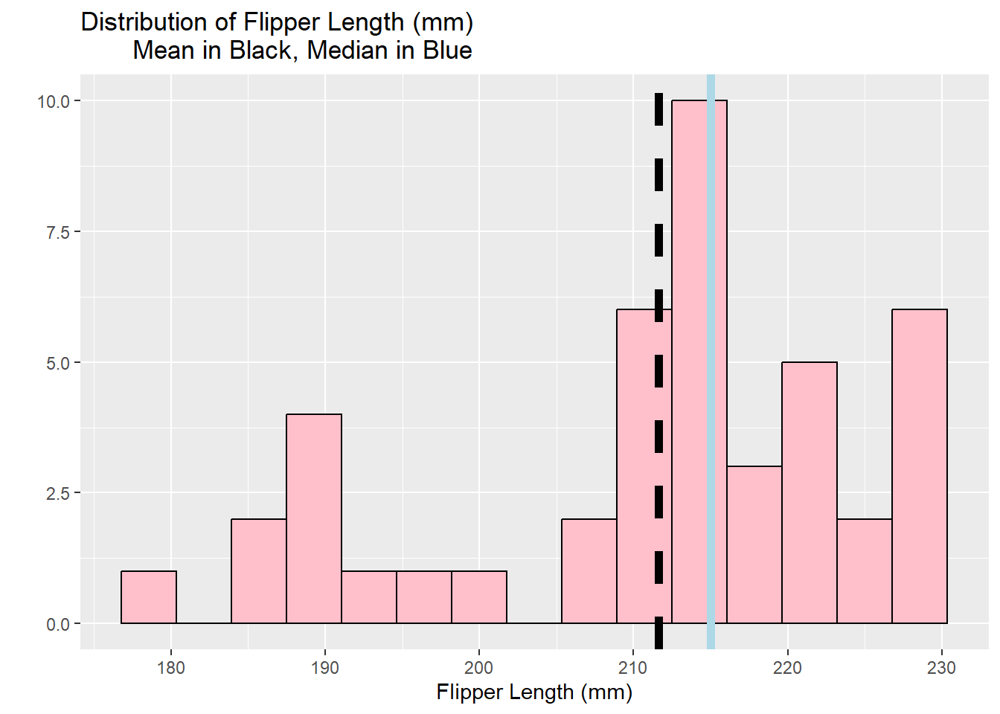
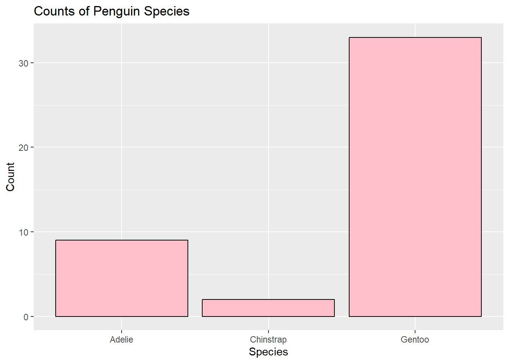
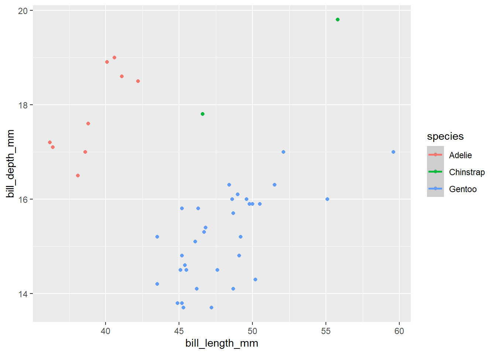

## Palmer Penguin Analysis

This is an analysis of the Palmer's Penguin dataset.

## Loading Packages and Datasets

Here we will load the tidyverse package and penguins data.


::: {.cell}

```{.r .cell-code}
#Load the tidyverse
library(tidyverse)
```

::: {.cell-output .cell-output-stderr}
```
── Attaching packages ─────────────────────────────────────── tidyverse 1.3.2 ──
✔ ggplot2 3.4.0      ✔ purrr   1.0.0 
✔ tibble  3.1.8      ✔ dplyr   1.0.10
✔ tidyr   1.2.1      ✔ stringr 1.5.0 
✔ readr   2.1.3      ✔ forcats 0.5.2 
── Conflicts ────────────────────────────────────────── tidyverse_conflicts() ──
✖ dplyr::filter() masks stats::filter()
✖ dplyr::lag()    masks stats::lag()
```
:::

```{.r .cell-code}
library (kableExtra)
```

::: {.cell-output .cell-output-stderr}
```

Attaching package: 'kableExtra'

The following object is masked from 'package:dplyr':

    group_rows
```
:::

```{.r .cell-code}
#Read the penguins_samp1 data file from github
penguins <- read_csv("https://raw.githubusercontent.com/mcduryea/Intro-to-Bioinformatics/main/data/penguins_samp1.csv")
```

::: {.cell-output .cell-output-stderr}
```
Rows: 44 Columns: 8
── Column specification ────────────────────────────────────────────────────────
Delimiter: ","
chr (3): species, island, sex
dbl (5): bill_length_mm, bill_depth_mm, flipper_length_mm, body_mass_g, year

ℹ Use `spec()` to retrieve the full column specification for this data.
ℹ Specify the column types or set `show_col_types = FALSE` to quiet this message.
```
:::

```{.r .cell-code}
#See the first six rows of the data we've read in to our notebook
penguins %>% 
  head()%>% 
  kable() %>% 
  kable_styling (c("striped", "hover"))
```

::: {.cell-output-display}

`````{=html}
<table class="table table-striped table-hover" style="margin-left: auto; margin-right: auto;">
 <thead>
  <tr>
   <th style="text-align:left;"> species </th>
   <th style="text-align:left;"> island </th>
   <th style="text-align:right;"> bill_length_mm </th>
   <th style="text-align:right;"> bill_depth_mm </th>
   <th style="text-align:right;"> flipper_length_mm </th>
   <th style="text-align:right;"> body_mass_g </th>
   <th style="text-align:left;"> sex </th>
   <th style="text-align:right;"> year </th>
  </tr>
 </thead>
<tbody>
  <tr>
   <td style="text-align:left;"> Gentoo </td>
   <td style="text-align:left;"> Biscoe </td>
   <td style="text-align:right;"> 59.6 </td>
   <td style="text-align:right;"> 17.0 </td>
   <td style="text-align:right;"> 230 </td>
   <td style="text-align:right;"> 6050 </td>
   <td style="text-align:left;"> male </td>
   <td style="text-align:right;"> 2007 </td>
  </tr>
  <tr>
   <td style="text-align:left;"> Gentoo </td>
   <td style="text-align:left;"> Biscoe </td>
   <td style="text-align:right;"> 48.6 </td>
   <td style="text-align:right;"> 16.0 </td>
   <td style="text-align:right;"> 230 </td>
   <td style="text-align:right;"> 5800 </td>
   <td style="text-align:left;"> male </td>
   <td style="text-align:right;"> 2008 </td>
  </tr>
  <tr>
   <td style="text-align:left;"> Gentoo </td>
   <td style="text-align:left;"> Biscoe </td>
   <td style="text-align:right;"> 52.1 </td>
   <td style="text-align:right;"> 17.0 </td>
   <td style="text-align:right;"> 230 </td>
   <td style="text-align:right;"> 5550 </td>
   <td style="text-align:left;"> male </td>
   <td style="text-align:right;"> 2009 </td>
  </tr>
  <tr>
   <td style="text-align:left;"> Gentoo </td>
   <td style="text-align:left;"> Biscoe </td>
   <td style="text-align:right;"> 51.5 </td>
   <td style="text-align:right;"> 16.3 </td>
   <td style="text-align:right;"> 230 </td>
   <td style="text-align:right;"> 5500 </td>
   <td style="text-align:left;"> male </td>
   <td style="text-align:right;"> 2009 </td>
  </tr>
  <tr>
   <td style="text-align:left;"> Gentoo </td>
   <td style="text-align:left;"> Biscoe </td>
   <td style="text-align:right;"> 55.1 </td>
   <td style="text-align:right;"> 16.0 </td>
   <td style="text-align:right;"> 230 </td>
   <td style="text-align:right;"> 5850 </td>
   <td style="text-align:left;"> male </td>
   <td style="text-align:right;"> 2009 </td>
  </tr>
  <tr>
   <td style="text-align:left;"> Gentoo </td>
   <td style="text-align:left;"> Biscoe </td>
   <td style="text-align:right;"> 49.8 </td>
   <td style="text-align:right;"> 15.9 </td>
   <td style="text-align:right;"> 229 </td>
   <td style="text-align:right;"> 5950 </td>
   <td style="text-align:left;"> male </td>
   <td style="text-align:right;"> 2009 </td>
  </tr>
</tbody>
</table>

`````

:::
:::


The table represents the penguin species, islands they inhabit, bill length, bill depth, flipper length, and body mass. This data will be used for further analysis.

You can add options to executable code like this.


::: {.cell}
::: {.cell-output .cell-output-stdout}
```
[1] 4
```
:::
:::


The `echo: false` option disables the printing of code (only output is displayed).

## About Our Data

The data we are working with is a dataset on penguins, which includes 8 features measured on 44 penguins. The features included are physiological features (like bill length, bill depth, flipper length, body mass, etc) as well as other features like the year that the penguin was observed, the island the penguin was observed on, the sex, and the species of the penguin.

## Interesting Questions to Ask

We ask these questions to differentiate among species, sex, and island. Analyzing these differences may suggest evolutionary or adaptive changes developed by the penguins.

-   What is the average flipper length? What about for each species?

-   Are there more male or female penguins? What about per island or species?

-   What is the average body mass? What about by island? By species? By sex?

-   What is the ratio of bill length to bill depth for a penguin? What is the overall average of this metric? Does it change by species, sex, or island?

-   Does average body mass change by year?

    ## Data Manipulation Tools and Strategies

    We can look at individual columns in a data set or subsets of columns in a dataset. For example, if we are only interested in flipper length and species, we can `select()` those columns. Here we look at body mass and species to determine if there is an association between species and size. By analyzing this data, we can determine if some species are smaller or larger than others in this dataset.


    ::: {.cell}
    
    ```{.r .cell-code}
    penguins %>%
      select(species, body_mass_g) 
    ```
    
    ::: {.cell-output .cell-output-stdout}
    ```
    # A tibble: 44 × 2
       species body_mass_g
       <chr>         <dbl>
     1 Gentoo         6050
     2 Gentoo         5800
     3 Gentoo         5550
     4 Gentoo         5500
     5 Gentoo         5850
     6 Gentoo         5950
     7 Gentoo         5700
     8 Gentoo         5350
     9 Gentoo         5550
    10 Gentoo         6300
    # … with 34 more rows
    ```
    :::
    :::


If we want to `filter()` and only show certain rows, we can do that too. Here, we use the `filter()` function to analyze bill length and bill depth by species and island. Analysis of this data may show differences between bill length and bill depth by species or geographical location, which may pose further research questions. What about the environment or evolution of the species causes these differences? However, in this dataset there are not the same amount of penguins per species, which causes difficulty making statements about the species in the dataset. Because we have a large amount of Adelie penguins, we may draw conclusions about that species in this dataset, but with a small amount of Chinstrap and Gentoo penguins, it is difficult to draw conclusions that may speak to the species as a whole.


::: {.cell}

```{.r .cell-code}
#we can filter by species (categorical variables) 
penguins %>%
  filter(species == "Chinstrap") 
```

::: {.cell-output .cell-output-stdout}
```
# A tibble: 2 × 8
  species   island bill_length_mm bill_depth_mm flipper_le…¹ body_…² sex    year
  <chr>     <chr>           <dbl>         <dbl>        <dbl>   <dbl> <chr> <dbl>
1 Chinstrap Dream            55.8          19.8          207    4000 male   2009
2 Chinstrap Dream            46.6          17.8          193    3800 fema…  2007
# … with abbreviated variable names ¹​flipper_length_mm, ²​body_mass_g
```
:::

```{.r .cell-code}
#we can also filter by numerical variables
penguins %>%
  filter(body_mass_g >= 6000)
```

::: {.cell-output .cell-output-stdout}
```
# A tibble: 2 × 8
  species island bill_length_mm bill_depth_mm flipper_leng…¹ body_…² sex    year
  <chr>   <chr>           <dbl>         <dbl>          <dbl>   <dbl> <chr> <dbl>
1 Gentoo  Biscoe           59.6          17              230    6050 male   2007
2 Gentoo  Biscoe           49.2          15.2            221    6300 male   2007
# … with abbreviated variable names ¹​flipper_length_mm, ²​body_mass_g
```
:::

```{.r .cell-code}
#we can also do both
penguins %>% 
  filter ((body_mass_g >= 6000)|(island == "Torgersen"))
```

::: {.cell-output .cell-output-stdout}
```
# A tibble: 7 × 8
  species island    bill_length_mm bill_depth_mm flipper_l…¹ body_…² sex    year
  <chr>   <chr>              <dbl>         <dbl>       <dbl>   <dbl> <chr> <dbl>
1 Gentoo  Biscoe              59.6          17           230    6050 male   2007
2 Gentoo  Biscoe              49.2          15.2         221    6300 male   2007
3 Adelie  Torgersen           40.6          19           199    4000 male   2009
4 Adelie  Torgersen           38.8          17.6         191    3275 fema…  2009
5 Adelie  Torgersen           41.1          18.6         189    3325 male   2009
6 Adelie  Torgersen           38.6          17           188    2900 fema…  2009
7 Adelie  Torgersen           36.2          17.2         187    3150 fema…  2009
# … with abbreviated variable names ¹​flipper_length_mm, ²​body_mass_g
```
:::
:::


## Answering Our Questions

Most of our questions involve summarizing data, and perhaps summarizing over groups. We can summarize data using the `summarize()` function and group data using `group_by()`.

Let's find the average flipper length. Table 1 shows the overall flipper length average, while Table 2 shows the average flipper length in the Gentoo species, and Table 3 represents average flipper length across the 3 species individually. This data shows that the Gentoo penguins had the largest average flipper length. These tables were created using the `summarize()` and `group_by()` functions.


::: {.cell}

```{.r .cell-code}
#Overall average flipper length
penguins %>%
  summarize(avg_flipper_length = mean(flipper_length_mm))
```

::: {.cell-output .cell-output-stdout}
```
# A tibble: 1 × 1
  avg_flipper_length
               <dbl>
1               212.
```
:::

```{.r .cell-code}
#Single Species Average
penguins %>%
  filter(species == "Gentoo") %>%
  summarize(avg_flipper_length = mean(flipper_length_mm))
```

::: {.cell-output .cell-output-stdout}
```
# A tibble: 1 × 1
  avg_flipper_length
               <dbl>
1               218.
```
:::

```{.r .cell-code}
#Grouped Average
penguins %>%
  group_by(species) %>%
  summarize(avg_flipper_length = mean(flipper_length_mm))
```

::: {.cell-output .cell-output-stdout}
```
# A tibble: 3 × 2
  species   avg_flipper_length
  <chr>                  <dbl>
1 Adelie                  189.
2 Chinstrap               200 
3 Gentoo                  218.
```
:::
:::


How many of each species do we have? This can be found using the `count()` function. This is important when analyzing and comparing quantitative data to ensure accuracy, especially when drawing conclusions in a dataset.


::: {.cell}

```{.r .cell-code}
penguins %>%
  count(species)
```

::: {.cell-output .cell-output-stdout}
```
# A tibble: 3 × 2
  species       n
  <chr>     <int>
1 Adelie        9
2 Chinstrap     2
3 Gentoo       33
```
:::
:::


How many of each sex are there? What about by island or species? When measuring anatomic features of animals, sex is important, as in some species, certain traits are particular to one sex of the species.


::: {.cell}

```{.r .cell-code}
penguins %>% 
  count(sex)
```

::: {.cell-output .cell-output-stdout}
```
# A tibble: 2 × 2
  sex        n
  <chr>  <int>
1 female    20
2 male      24
```
:::

```{.r .cell-code}
penguins%>%
  group_by(species) %>%
  count(sex)
```

::: {.cell-output .cell-output-stdout}
```
# A tibble: 6 × 3
# Groups:   species [3]
  species   sex        n
  <chr>     <chr>  <int>
1 Adelie    female     6
2 Adelie    male       3
3 Chinstrap female     1
4 Chinstrap male       1
5 Gentoo    female    13
6 Gentoo    male      20
```
:::
:::


We can use `mutate()` to add new columns to our data set. Here we found the average bill length to depth ratio, first in the dataset as a whole, and then by species, using the `mutate()`, `summarize()`, and `group_by()` functions. The data suggests that the Gentoo penguins have the largest bill length to depth ratio, but it must again be remembered that there is a much larger sample of Gentoo penguins compared to the other species. Additionally, there is a large amount of male penguins in the species, which in many species are found to be the larger of the sex, and therefor develop larger features, potentially like bills. To gather a better understanding regarding differences among species, the dataset would require more even amounts of penguins per species.


::: {.cell}

```{.r .cell-code}
#To make a permanet change, we need to store the results of our manipulations
penguins_with_ratio <- penguins %>%
  mutate(bill_ltd_ratio = bill_length_mm /bill_depth_mm)

#Average Ratio 
penguins %>%
  mutate(bill_ltd_ratio = bill_length_mm /bill_depth_mm) %>%
  summarize (mean_bill_ltd_ratio = mean(bill_ltd_ratio),
             median_bill_ltd_ratio = median(bill_ltd_ratio))
```

::: {.cell-output .cell-output-stdout}
```
# A tibble: 1 × 2
  mean_bill_ltd_ratio median_bill_ltd_ratio
                <dbl>                 <dbl>
1                2.95                  3.06
```
:::

```{.r .cell-code}
#Average Ratio by Group
penguins %>%
  mutate(bill_ltd_ratio = bill_length_mm /bill_depth_mm) %>%
  group_by(species) %>%
  summarize (mean_bill_ltd_ratio = mean(bill_ltd_ratio),
             median_bill_ltd_ratio = median(bill_ltd_ratio))
```

::: {.cell-output .cell-output-stdout}
```
# A tibble: 3 × 3
  species   mean_bill_ltd_ratio median_bill_ltd_ratio
  <chr>                   <dbl>                 <dbl>
1 Adelie                   2.20                  2.20
2 Chinstrap                2.72                  2.72
3 Gentoo                   3.17                  3.13
```
:::
:::


Here we find average body mass by year. In animal species, body mass can fluctuate by year. Fluctuations where average body mass by year drops drastically or declines slowly may be cause for concern, and can be caused by loss of environment, lack of food, disease, competition, etc. The steady decline in average body mass from 2007-2009 represented by the table may be worrisome for the penguin populations in this dataset.


::: {.cell}

```{.r .cell-code}
penguins %>%
  group_by(year) %>%
  summarize(mean_body_mass = mean(body_mass_g))
```

::: {.cell-output .cell-output-stdout}
```
# A tibble: 3 × 2
   year mean_body_mass
  <dbl>          <dbl>
1  2007          5079.
2  2008          4929.
3  2009          4518.
```
:::
:::


## Data Visualization 

-   What is the distribution of penguin flipper lengths?

-   What is the distribution of penguin species?

-   Does the distribution of flipper length depend on the species of penguin?

-   Is there a correlation between bill length and bill depth?


::: {.cell}

```{.r .cell-code}
penguins %>%
  ggplot () +
  geom_histogram( aes(x = flipper_length_mm), 
                  bins = 15, 
                  fill = "pink" , 
                  color = "black")+
  labs(title = "Distribution of Flipper Length (mm)
       Mean in Black, Median in Blue", 
       y = "", x = "Flipper Length (mm)") +
  geom_vline (aes(xintercept = mean(flipper_length_mm)) , lwd = 2, lty = "dashed") +
  geom_vline (aes(xintercept = median (flipper_length_mm)), color = "lightblue" , lwd = 2, lty = "solid")
```

::: {.cell-output .cell-output-stderr}
```
Warning: Using `size` aesthetic for lines was deprecated in ggplot2 3.4.0.
ℹ Please use `linewidth` instead.
```
:::

::: {.cell-output-display}
{width=672}
:::
:::


Above, we created a histogram to visualize the distribution of penguin flipper lengths. The black dashed line represents the dataset mean, and the blue solid line represents the dataset median. In this dataset, the average flipper length appears to range from about 205-215 mm, the lowest flipper length is around 170 mm, and the highest flipper length is 230 mm. This graph shows us how flipper length ranges across the dataset, but without species, island, or sex specification, it becomes difficult to differentiate the data for analysis.

We will now look at the distribution of species, using a histogram. This graph shows us that there is a significantly larger amount of Gentoo penguins than Adelie and Chinstrap. These numbers may skew analysis when grouping and comparing by species.


::: {.cell}

```{.r .cell-code}
penguins %>%
  ggplot() +
  geom_bar(mapping = aes(x = species), fill = "pink", color= "black") +
  labs(title = "Counts of Penguin Species" , x = "Species", y = "Count")
```

::: {.cell-output-display}
{width=672}
:::
:::


Let's make a scatter plot to determine if bill length is correlated with bill depth. The scatter plot shows that bill length is not necessarily correlated with bill depth, and different species show different associations between the two. The Adelie penguins showed significantly higher bill depth than the Gentoo species, but the Gentoo species showed significantly higher bill length than the Adelie penguins. The Chinstrap penguins show relatively high bill lengths and bill depths, but this is a difficult comparison to make because there are only 2 Chinstrap penguins, compared to the much larger populations of Gentoo and Adelie penguins in this dataset.


::: {.cell}

```{.r .cell-code}
penguins %>%
 ggplot() +
  geom_point(aes (x= bill_length_mm, y= bill_depth_mm, color = species))+
  geom_smooth(aes (x= bill_length_mm, y=bill_depth_mm, color = species))
```

::: {.cell-output .cell-output-stderr}
```
`geom_smooth()` using method = 'loess' and formula = 'y ~ x'
```
:::

::: {.cell-output .cell-output-stderr}
```
Warning in simpleLoess(y, x, w, span, degree = degree, parametric =
parametric, : span too small. fewer data values than degrees of freedom.
```
:::

::: {.cell-output .cell-output-stderr}
```
Warning in simpleLoess(y, x, w, span, degree = degree, parametric =
parametric, : at 46.554
```
:::

::: {.cell-output .cell-output-stderr}
```
Warning in simpleLoess(y, x, w, span, degree = degree, parametric =
parametric, : radius 0.002116
```
:::

::: {.cell-output .cell-output-stderr}
```
Warning in simpleLoess(y, x, w, span, degree = degree, parametric =
parametric, : all data on boundary of neighborhood. make span bigger
```
:::

::: {.cell-output .cell-output-stderr}
```
Warning in simpleLoess(y, x, w, span, degree = degree, parametric =
parametric, : pseudoinverse used at 46.554
```
:::

::: {.cell-output .cell-output-stderr}
```
Warning in simpleLoess(y, x, w, span, degree = degree, parametric =
parametric, : neighborhood radius 0.046
```
:::

::: {.cell-output .cell-output-stderr}
```
Warning in simpleLoess(y, x, w, span, degree = degree, parametric =
parametric, : reciprocal condition number 1
```
:::

::: {.cell-output .cell-output-stderr}
```
Warning in simpleLoess(y, x, w, span, degree = degree, parametric =
parametric, : at 55.846
```
:::

::: {.cell-output .cell-output-stderr}
```
Warning in simpleLoess(y, x, w, span, degree = degree, parametric =
parametric, : radius 0.002116
```
:::

::: {.cell-output .cell-output-stderr}
```
Warning in simpleLoess(y, x, w, span, degree = degree, parametric =
parametric, : all data on boundary of neighborhood. make span bigger
```
:::

::: {.cell-output .cell-output-stderr}
```
Warning in simpleLoess(y, x, w, span, degree = degree, parametric =
parametric, : There are other near singularities as well. 0.002116
```
:::

::: {.cell-output .cell-output-stderr}
```
Warning in simpleLoess(y, x, w, span, degree = degree, parametric =
parametric, : zero-width neighborhood. make span bigger

Warning in simpleLoess(y, x, w, span, degree = degree, parametric =
parametric, : zero-width neighborhood. make span bigger
```
:::

::: {.cell-output .cell-output-stderr}
```
Warning: Computation failed in `stat_smooth()`
Caused by error in `predLoess()`:
! NA/NaN/Inf in foreign function call (arg 5)
```
:::

::: {.cell-output-display}
{width=672}
:::
:::
